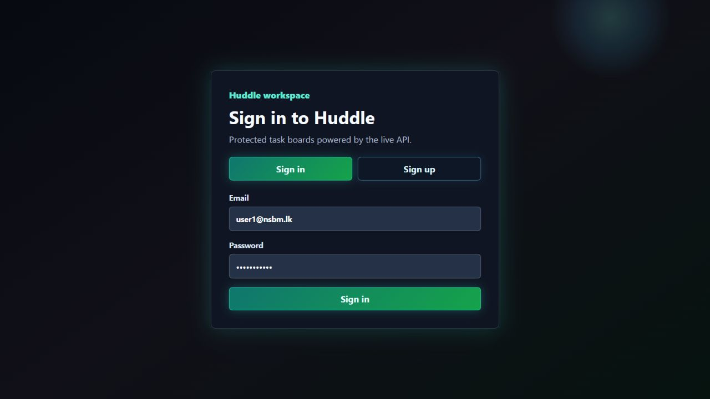
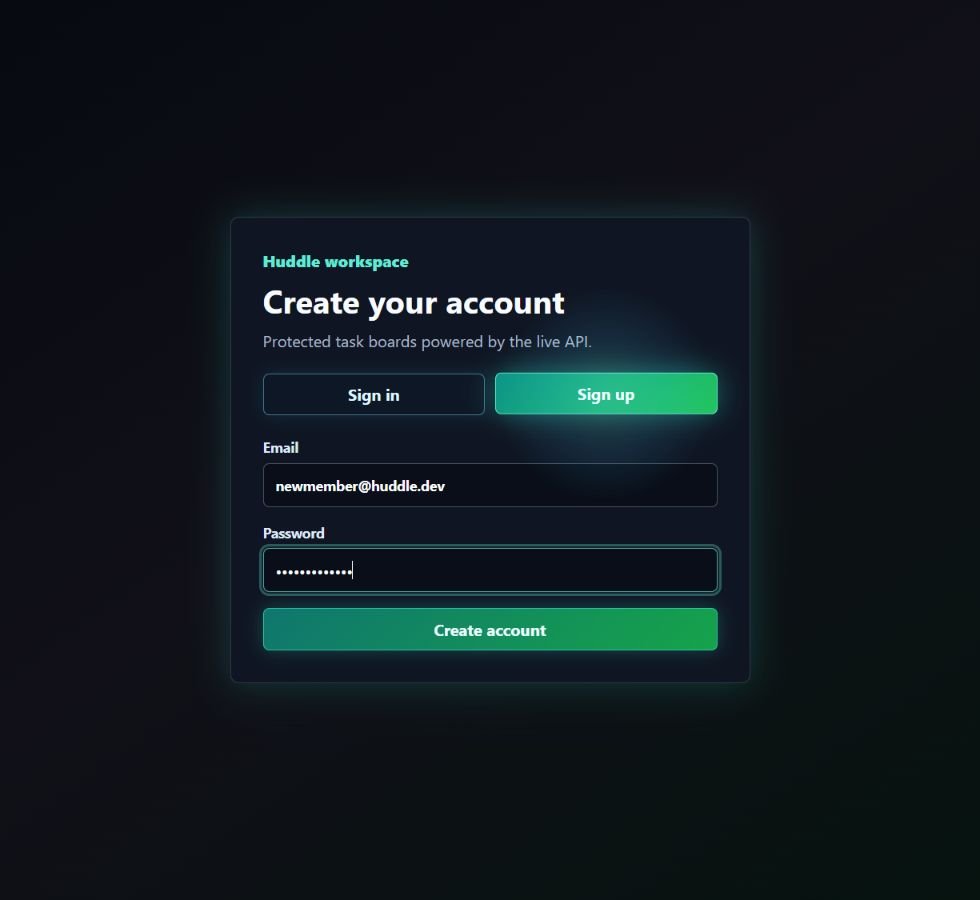
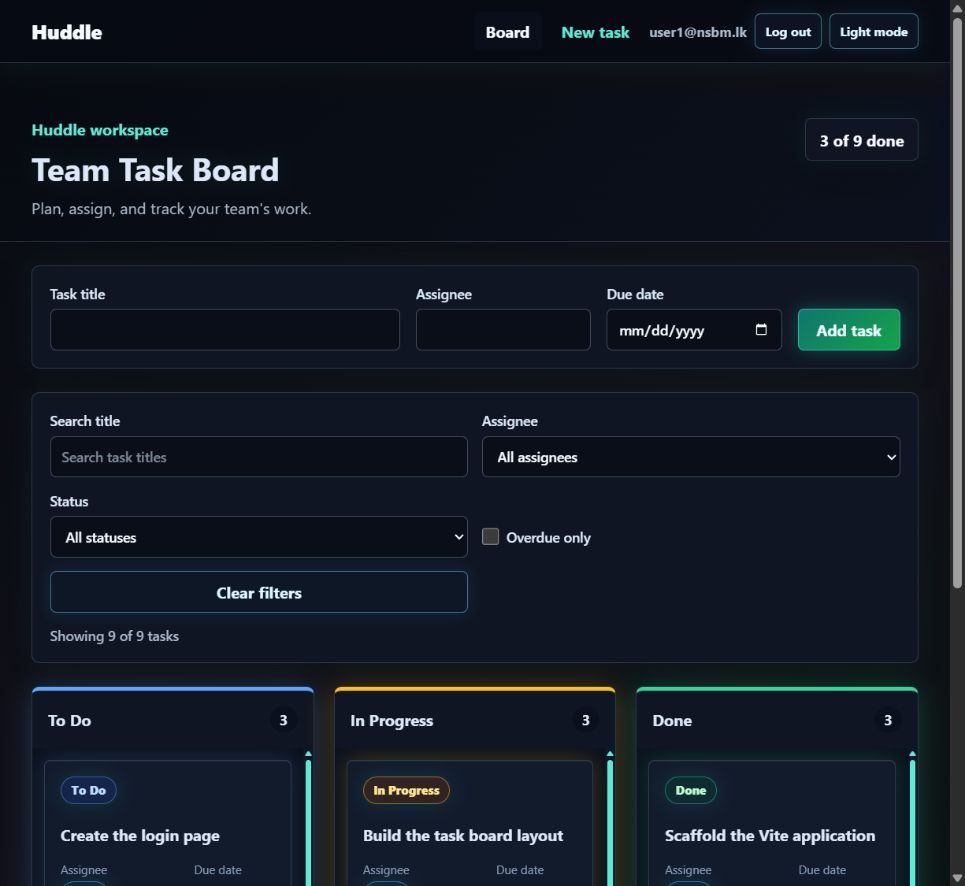
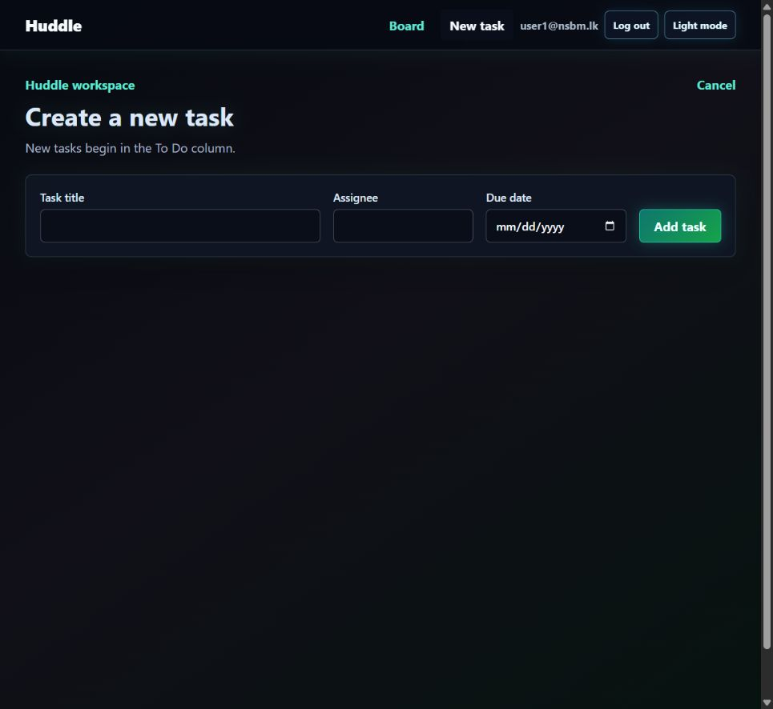
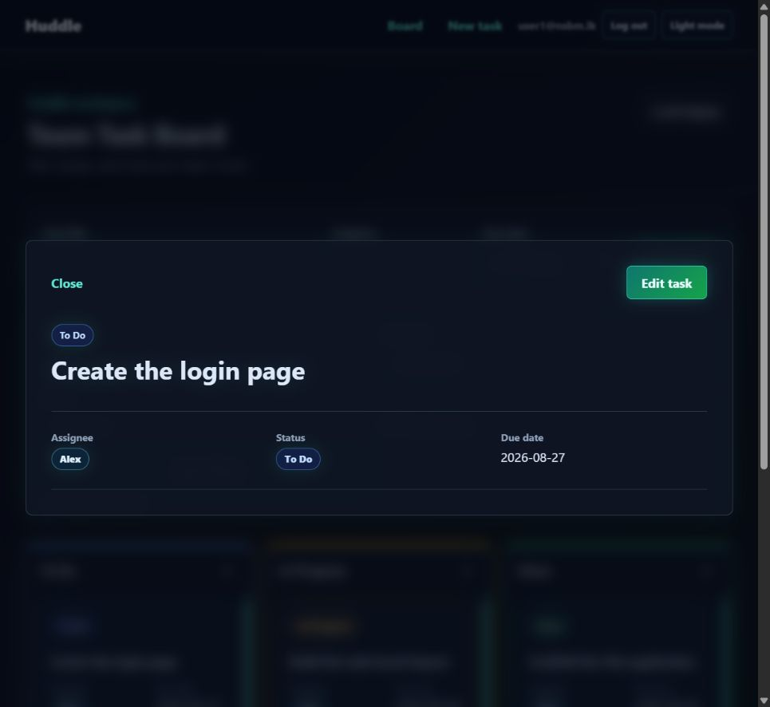
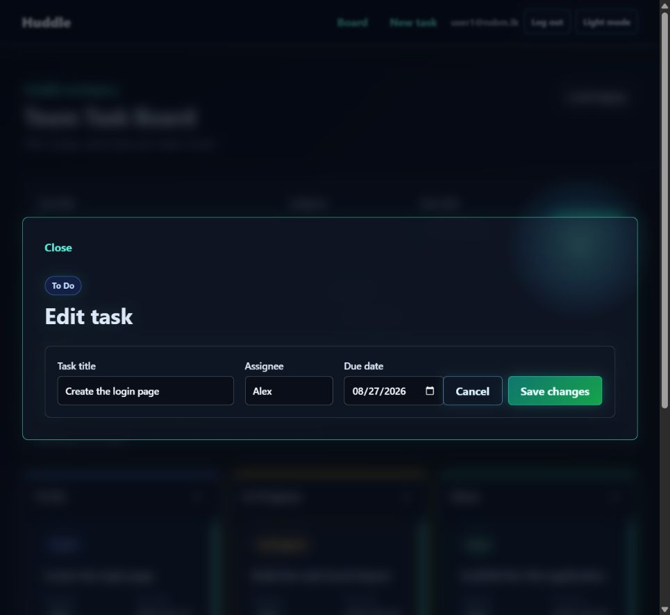
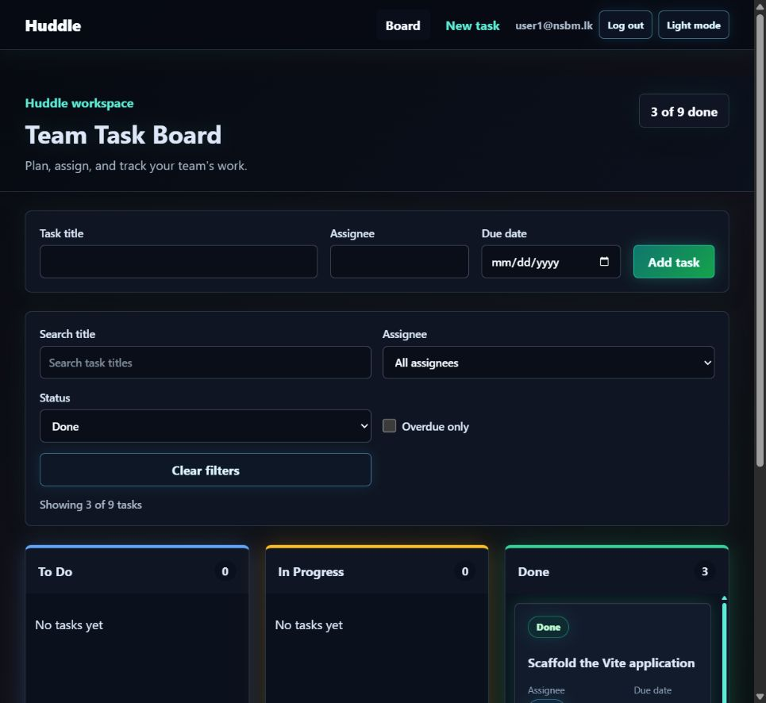
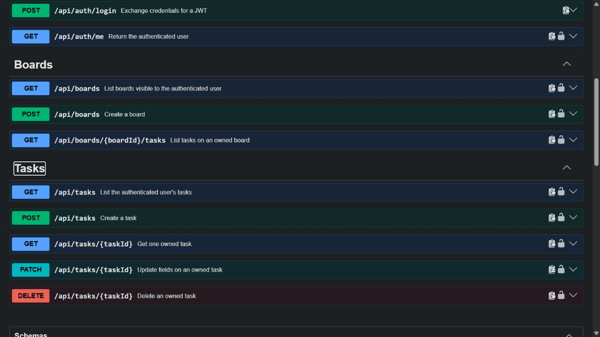
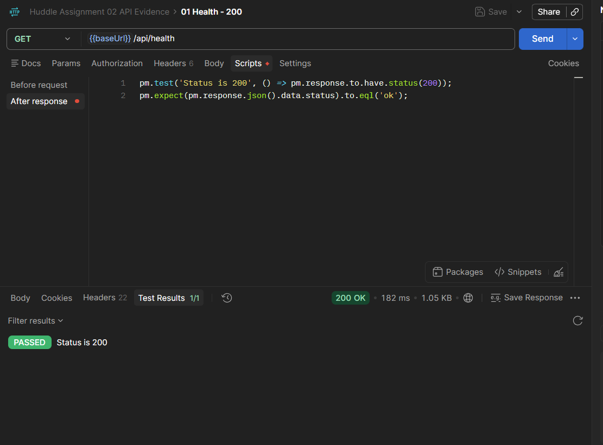

# Huddle

Huddle is a collaborative task board built progressively across five full-stack milestones. Assignment 02 completes the working REST API milestone: the React client now uses a layered Node.js and Express backend with validated CRUD, JWT authentication, ownership checks, board resources, API documentation, and reproducible Postman evidence.

Repository: [github.com/Dew3120/huddle](https://github.com/Dew3120/huddle)

Assignment 02 release tag: `assignment-02-working-rest-api`

## Table of Contents

- [Milestone Status](#milestone-status)
- [Assignment 02 Highlights](#assignment-02-highlights)
- [Architecture](#architecture)
- [Technology Stack](#technology-stack)
- [Quick Start](#quick-start)
- [API Documentation](#api-documentation)
- [API Contract](#api-contract)
- [Response Contract](#response-contract)
- [Authentication and Security Decisions](#authentication-and-security-decisions)
- [Frontend Integration](#frontend-integration)
- [Application Routes](#application-routes)
- [Project Structure](#project-structure)
- [Assignment 02 Evidence](#assignment-02-evidence)
- [Postman Evidence Index](#postman-evidence-index)
- [Team Roles and Contributions](#team-roles-and-contributions)
- [Verification Guide](#verification-guide)
- [Known Limitations](#known-limitations)
- [Release Tag](#release-tag)
- [Roadmap](#roadmap)

## Milestone Status

| Milestone          | Deliverable                                                | Status                                                           |
| ------------------ | ---------------------------------------------------------- | ---------------------------------------------------------------- |
| Assignment 01 / M1 | Static React front-end skeleton                            | Complete and tagged as `assignment-01-static-front-end-skeleton` |
| Assignment 02 / M2 | Working REST API with mock data integrated with the client | Complete on `feature/session-02-backend-foundation`              |
| M3                 | MongoDB persistence and offline support                    | Planned                                                          |
| M4                 | Automated client/server tests and CI                       | Planned                                                          |
| M5                 | Real-time sync, Docker, deployment, and final launch       | Planned                                                          |

Assignment 02 intentionally keeps server data in memory. MongoDB belongs to the next milestone, so a server restart resets users, boards, and tasks to their seeded state.

## Assignment 02 Highlights

- Responsive React task board with sign in, sign up, logout, and session restore.
- Live client integration through a centralized `fetch` wrapper and Vite `/api` proxy.
- Express REST API with routes, controllers, services, repositories, schemas, and middleware.
- Password hashing with `bcryptjs`; password hashes are never serialized to clients.
- One-hour signed JWT access tokens and protected auth, board, and task routes.
- Ownership checks in the service layer so users cannot access another user's resources.
- Full task CRUD with `201`, `200`, and `204` success responses.
- Board listing, board creation, and board-specific task listing.
- Zod validation on every write endpoint with per-field validation details.
- Consistent operational error responses and generic unexpected `500` responses.
- Filtering, sorting, and pagination for task collections, including board task collections.
- Swagger UI, OpenAPI 3.1 YAML/JSON, and an exported Postman collection.
- Saved evidence for success, authentication, validation, ownership, not-found, and delete flows.

## Architecture

```text
React page/component
        |
        v
src/api client  -- Authorization: Bearer <JWT> -->  Express route
                                                        |
                                                        v
                                                   Controller
                                                        |
                                                        v
                                                    Service
                                             validation/ownership/querying
                                                        |
                                                        v
                                                   Repository
                                                        |
                                                        v
                                              In-memory mock data
```

The controller is the HTTP boundary. It reads `req`, calls a service, and shapes the response. Services hold business rules, ownership checks, filtering, sorting, and pagination. Repositories own data access. No `req` or `res` object is passed below the controller layer.

The middleware order in `server/app.js` is deliberate: request IDs and logging, security and CORS, JSON parsing, public authentication routes with rate limiting on login, protected board/task routes, the catch-all 404 handler, and finally the central error handler.

## Technology Stack

| Layer              | Technology                                                  |
| ------------------ | ----------------------------------------------------------- |
| Client             | React 19, React Router, Context API, `useReducer`, Vite     |
| API                | Node.js, Express 5                                          |
| Validation         | Zod                                                         |
| Authentication     | `bcryptjs`, `jsonwebtoken`, `express-rate-limit`            |
| Security           | Helmet, configured CORS, generic `500` responses            |
| API reference      | OpenAPI 3.1, Swagger UI, Postman collection                 |
| Styling            | Global responsive CSS and CSS Modules for the shared button |
| Current data layer | In-memory repositories with seeded mock data                |

## Quick Start

### Prerequisites

- Node.js 20 or newer
- npm
- Git
- Optional: Postman for running the saved API collection

### 1. Clone and install

```powershell
git clone https://github.com/Dew3120/huddle.git
cd huddle
git checkout feature/session-02-backend-foundation
npm install
```

### 2. Configure the API

Create `.env` from the committed example:

```powershell
Copy-Item .env.example .env
```

Development values:

```env
PORT=4000
JWT_SECRET=replace-this-with-a-long-random-development-secret
CLIENT_ORIGIN=http://localhost:5173
```

Never commit a real JWT secret.

### 3. Start the backend

Open PowerShell terminal 1:

```powershell
npm run dev:server
```

The API runs at `http://localhost:4000`.

### 4. Start the frontend

Open PowerShell terminal 2:

```powershell
npm run dev
```

Open the URL printed by Vite, normally `http://localhost:5173`.

### 5. Sign in

```text
Email: user1@nsbm.lk
Password: password123
```

You can also create a new account from the Sign up tab. Because the Assignment 02 repositories are in memory, accounts created at runtime disappear when the API restarts.

### Production build

```powershell
npm run build
npm run preview
```

## API Documentation

Start the backend, then use either reference:

- Interactive Swagger UI: [http://localhost:4000/api/docs/](http://localhost:4000/api/docs/)
- OpenAPI JSON: [http://localhost:4000/api/openapi.json](http://localhost:4000/api/openapi.json)
- Source contract: [`docs/openapi.yaml`](docs/openapi.yaml)
- Postman collection: [`docs/api-evidence/Huddle Assignment 02 API Evidence.postman_collection.json`](docs/api-evidence/Huddle%20Assignment%2002%20API%20Evidence.postman_collection.json)

The Postman collection uses collection variables for `baseUrl`, `token`, and `taskId`. Login stores the returned JWT automatically, and task creation stores the new task ID for later PATCH and DELETE requests.

## API Contract

| Method and path             | Authentication | Purpose                        | Success | Common errors       |
| --------------------------- | -------------- | ------------------------------ | ------- | ------------------- |
| `GET /api/health`           | Public         | API health and uptime          | `200`   | `500`               |
| `POST /api/auth/register`   | Public         | Create an account              | `201`   | `400`, `409`        |
| `POST /api/auth/login`      | Public         | Exchange credentials for a JWT | `200`   | `400`, `401`, `429` |
| `GET /api/auth/me`          | Bearer JWT     | Return the current user        | `200`   | `401`               |
| `GET /api/boards`           | Bearer JWT     | List the user's boards         | `200`   | `401`               |
| `POST /api/boards`          | Bearer JWT     | Create a board                 | `201`   | `400`, `401`        |
| `GET /api/boards/:id/tasks` | Bearer JWT     | List tasks on an owned board   | `200`   | `401`, `404`        |
| `GET /api/tasks`            | Bearer JWT     | List tasks                     | `200`   | `401`               |
| `GET /api/tasks/:id`        | Bearer JWT     | Read one task                  | `200`   | `401`, `404`        |
| `POST /api/tasks`           | Bearer JWT     | Create a task                  | `201`   | `400`, `401`, `404` |
| `PATCH /api/tasks/:id`      | Bearer JWT     | Update task fields or status   | `200`   | `400`, `401`, `404` |
| `DELETE /api/tasks/:id`     | Bearer JWT     | Delete a task                  | `204`   | `401`, `404`        |

Task collection query parameters:

| Parameter  | Values                                                                   | Behavior                         |
| ---------- | ------------------------------------------------------------------------ | -------------------------------- |
| `status`   | `todo`, `in-progress`, `done`                                            | Exact status filter              |
| `assignee` | Text                                                                     | Case-insensitive assignee filter |
| `sort`     | `title`, `assignee`, `status`, `dueDate`; prefix with `-` for descending | Stable collection sort           |
| `page`     | Positive integer                                                         | Requested result page            |
| `limit`    | `1` to `100`                                                             | Results per page                 |

The same query behavior is available on `GET /api/boards/:id/tasks`.

## Response Contract

Collection success:

```json
{
  "data": [],
  "meta": {
    "page": 1,
    "limit": 20,
    "total": 0
  }
}
```

Single-resource success:

```json
{
  "data": {
    "id": "task-001"
  }
}
```

Error response:

```json
{
  "error": {
    "message": "Task not found",
    "code": "TASK_NOT_FOUND",
    "requestId": "request-correlation-id"
  }
}
```

Validation errors also include `error.details`. Unexpected server errors return the generic message `Something went wrong` with code `INTERNAL_ERROR`; stack traces and internal exception messages are not sent to the client.

## Authentication and Security Decisions

### Why localStorage was chosen

Assignment 02 uses an access token in `localStorage` because this milestone requires a simple React-to-Express bearer-token flow that survives a page refresh. The centralized API client reads one token, attaches one `Authorization` header, and clears the session after any `401`. This keeps the workshop implementation small and observable in Postman and browser developer tools.

This is a milestone tradeoff, not the strongest production design. JavaScript can read `localStorage`, so a successful cross-site scripting attack could steal the token. Huddle reduces the exposure window with a short-lived token, avoids placing secrets in the JWT payload, and keeps the token handling in one client module.

### Why the JWT expires after one hour

One hour balances workshop usability with risk. It is long enough to complete a normal development or demonstration session without repeated logins, while a leaked token stops working automatically after a bounded period. Tokens that never expire are deliberately avoided.

### What changes in a later production version

A production version would use a short-lived access token plus a rotating refresh token stored in a `Secure`, `httpOnly`, `SameSite` cookie. JavaScript could not read the refresh token. The server would persist refresh-token identifiers, rotate them on use, revoke them on logout or suspected reuse, and issue new access tokens through a dedicated refresh endpoint. Cookie authentication would also require explicit credential-aware CORS configuration and CSRF protection. Secrets would come from the deployment platform, never Git.

## Frontend Integration

- `src/api/client.js` owns base URL selection, JSON headers, JWT attachment, error conversion, `204` handling, and central `401` expiry behavior.
- `src/api/auth.js` contains register, login, and current-user requests.
- `src/api/tasks.js` contains live task CRUD calls. No component imports mock task data.
- `AuthProvider` restores the token-backed session and exposes `login`, `register`, and `logout`.
- `TasksProvider` loads tasks and applies successful API mutations to shared reducer state.
- Loading, empty, validation, network-error, and retry states are driven by real HTTP behavior.
- Vite proxies `/api` to `http://localhost:4000` during development; Express also has environment-controlled CORS for deployed origins.

## Application Routes

| Client route      | Purpose                  |
| ----------------- | ------------------------ |
| `/`               | Authenticated task board |
| `/tasks/new`      | Create-task screen       |
| `/tasks/:id`      | Task detail modal        |
| `/tasks/:id/edit` | Task edit modal          |
| `*`               | Client not-found screen  |

Unauthenticated users see the combined Sign in / Sign up screen before protected application routes are rendered.

## Project Structure

```text
huddle/
+-- docs/
|   +-- api-evidence/
|   |   +-- Huddle Assignment 02 API Evidence.postman_collection.json
|   |   +-- 01-health-200.png ... 20-task-delete-204.png
|   +-- screenshots/
|   |   +-- assignment-02/
|   |       +-- 01-sign-in-live-api.png ... 09-backend-health-response.png
|   +-- openapi.yaml
+-- server/
|   +-- app.js
|   +-- config.js
|   +-- openapi.js
|   +-- server.js
|   +-- controllers/
|   |   +-- authController.js
|   |   +-- boardController.js
|   |   +-- taskController.js
|   +-- data/
|   |   +-- boards.js
|   |   +-- tasks.js
|   +-- middleware/
|   |   +-- authenticate.js
|   |   +-- errorHandler.js
|   |   +-- requestId.js
|   |   +-- requestLogger.js
|   |   +-- validate.js
|   +-- repositories/
|   |   +-- boardRepository.js
|   |   +-- taskRepository.js
|   |   +-- userRepository.js
|   +-- routes/
|   |   +-- authRoutes.js
|   |   +-- boardRoutes.js
|   |   +-- taskRoutes.js
|   +-- schemas/
|   |   +-- authSchema.js
|   |   +-- boardSchema.js
|   |   +-- taskSchema.js
|   +-- services/
|   |   +-- authService.js
|   |   +-- boardService.js
|   |   +-- taskService.js
|   +-- utils/
|       +-- AppError.js
|       +-- asyncHandler.js
|       +-- taskCollection.js
+-- src/
|   +-- api/
|   |   +-- auth.js
|   |   +-- client.js
|   |   +-- tasks.js
|   +-- components/
|   |   +-- Button/
|   |   +-- AddTaskForm.jsx
|   |   +-- AppNavigation.jsx
|   |   +-- Board.jsx
|   |   +-- Column.jsx
|   |   +-- EditTaskForm.jsx
|   |   +-- TaskCard.jsx
|   |   +-- TaskFilters.jsx
|   +-- context/
|   |   +-- AuthProvider.jsx
|   |   +-- TasksProvider.jsx
|   +-- hooks/
|   +-- pages/
|   +-- utils/
|   +-- App.jsx
|   +-- index.css
|   +-- main.jsx
+-- .env.example
+-- package.json
+-- vite.config.js
```

## Assignment 02 Evidence

All current UI images were captured against the live Express API, not local mock tasks.

### Authentication

| Sign in                                                                                             | Sign up                                                                                             |
| --------------------------------------------------------------------------------------------------- | --------------------------------------------------------------------------------------------------- |
|  |  |

### Live task workflows



| Create task                                                                                            | Task detail                                                                                    |
| ------------------------------------------------------------------------------------------------------ | ---------------------------------------------------------------------------------------------- |
|  |  |

| Edit task                                                                                          | Server-backed status filter                                                                           |
| -------------------------------------------------------------------------------------------------- | ----------------------------------------------------------------------------------------------------- |
|  |  |

### Backend reference and health

| Swagger API reference                                                                                       | Health endpoint evidence                                                                                |
| ----------------------------------------------------------------------------------------------------------- | ------------------------------------------------------------------------------------------------------- |
|  |  |

## Postman Evidence Index

The committed collection and screenshots form a repeatable manual API test suite.

| File                                                                               | Evidence                                          |
| ---------------------------------------------------------------------------------- | ------------------------------------------------- |
| [`01-health-200.png`](docs/api-evidence/01-health-200.png)                         | Public health endpoint returns `200`              |
| [`02-register-success-201.png`](docs/api-evidence/02-register-success-201.png)     | Registration returns `201` and public user data   |
| [`03-register-duplicate-409.png`](docs/api-evidence/03-register-duplicate-409.png) | Duplicate email returns `409 EMAIL_EXISTS`        |
| [`04-login-200.png`](docs/api-evidence/04-login-200.png)                           | Login returns a one-hour JWT                      |
| [`05-current-user-200.png`](docs/api-evidence/05-current-user-200.png)             | Protected current-user request returns `200`      |
| [`06-tasks-no-token-401.png`](docs/api-evidence/06-tasks-no-token-401.png)         | Missing bearer token returns `401 NO_TOKEN`       |
| [`07-tasks-bad-token-401.png`](docs/api-evidence/07-tasks-bad-token-401.png)       | Invalid token returns `401 BAD_TOKEN`             |
| [`08-tasks-list-200.png`](docs/api-evidence/08-tasks-list-200.png)                 | Authenticated task list returns data and metadata |
| [`09-task-filter-200.png`](docs/api-evidence/09-task-filter-200.png)               | Collection query returns filtered tasks           |
| [`10-boards-list-200.png`](docs/api-evidence/10-boards-list-200.png)               | Authenticated board list returns `200`            |
| [`11-board-create-201.png`](docs/api-evidence/11-board-create-201.png)             | Board creation returns `201`                      |
| [`12-board-tasks-200.png`](docs/api-evidence/12-board-tasks-200.png)               | Board task collection returns `200`               |
| [`13-board-ownership-404.png`](docs/api-evidence/13-board-ownership-404.png)       | Another user's board is concealed with `404`      |
| [`14-task-create-201.png`](docs/api-evidence/14-task-create-201.png)               | Valid task creation returns `201`                 |
| [`15-task-validation-400.png`](docs/api-evidence/15-task-validation-400.png)       | Invalid title returns field-level `400` details   |
| [`16-task-detail-200.png`](docs/api-evidence/16-task-detail-200.png)               | Owned task detail returns `200`                   |
| [`17-task-update-200.png`](docs/api-evidence/17-task-update-200.png)               | Task update returns `200`                         |
| [`18-task-not-found-404.png`](docs/api-evidence/18-task-not-found-404.png)         | Missing task returns `404 TASK_NOT_FOUND`         |
| [`19-task-ownership-404.png`](docs/api-evidence/19-task-ownership-404.png)         | Another user's task is concealed with `404`       |
| [`20-task-delete-204.png`](docs/api-evidence/20-task-delete-204.png)               | Task deletion returns `204` with no body          |

## Team Roles and Contributions

| Team member            | Assignment 02 role and contribution                                                                                                                                                          |
| ---------------------- | -------------------------------------------------------------------------------------------------------------------------------------------------------------------------------------------- |
| T D Gnanasena          | Project coordination, backend architecture, authentication, CRUD, validation, ownership, client/API integration, Swagger/OpenAPI, documentation, integration review, and release preparation |
| J Charles              | Protected board API endpoints, board ownership checks, and board-task query integration through a reviewed feature branch and pull request                                                    |
| K V Dilnath (Vinuka)   | Task search/filter contribution plus the exported Postman collection, request assertions, and API evidence screenshots                                                                       |
| R S Bokalagama (Rovin) | Assignment 02 API verification runner, reproducible 17-check smoke-test coverage, and verification documentation                                                                              |

The repository uses feature branches and pull requests so individual contributions remain visible in Git history. Do not squash or rewrite that history before submission.

## Verification Guide

### Build and contract checks

```powershell
npm install
npm run build
npm audit
```

With the API running:

```powershell
curl.exe http://localhost:4000/api/health
curl.exe -I http://localhost:4000/api/docs/
curl.exe http://localhost:4000/api/openapi.json
```

### Manual end-to-end checks

1. Register a new user and confirm the response does not expose a password hash.
2. Log in and confirm the response contains a token and public user data.
3. Call `/api/auth/me` with the token and receive `200`.
4. Call `/api/tasks` without a token and receive `401 NO_TOKEN`.
5. Load the React board and confirm live tasks appear in the correct columns.
6. Create, read, update, move, and delete a task.
7. Submit an invalid two-character title and confirm field-level `400` details render.
8. Filter by status and assignee, sort by due date, and verify pagination metadata.
9. Query `/api/boards/:id/tasks` with the same filters.
10. Request another user's board/task and confirm the API conceals it with `404`.
11. Log out and confirm the protected client returns to the authentication screen.
12. Import and run the committed Postman collection as the saved API contract evidence.

## Known Limitations

- Users, boards, and tasks are stored in memory and reset when the server restarts. MongoDB is the M3 deliverable.
- The current ownership model gives each seeded board one owner. Multi-member board roles and invitations are later domain work.
- Access tokens are stored in `localStorage`; refresh tokens, rotation, revocation, CSRF protection, and cookie-based sessions are not part of M2.
- Automated client/server tests and GitHub Actions are M4 deliverables.
- WebSocket updates, conflict detection, Docker Compose, and public deployment are M5 deliverables.
- The Swagger/OpenAPI reference is included as an Assignment 02 bonus; the committed Postman collection remains the primary manual evidence set.

## Release Tag

The final Assignment 02 snapshot is identified by:

```text
assignment-02-working-rest-api
```

After all team pull requests and final evidence are merged, the release owner creates and pushes the annotated tag:

```powershell
git checkout feature/session-02-backend-foundation
git pull origin feature/session-02-backend-foundation
git tag -a assignment-02-working-rest-api -m "Assignment 02 - Working REST APIs integrated with frontend"
git push origin assignment-02-working-rest-api
```

To inspect that exact submission later:

```powershell
git checkout assignment-02-working-rest-api
```

## Roadmap

- M3: replace in-memory repositories with MongoDB/Mongoose and add client-side offline caching.
- M4: add Jest, React Testing Library, Supertest, and GitHub Actions.
- M5: add Socket.io live updates, conflict detection, Docker Compose, public deployment, and final team reflection.
