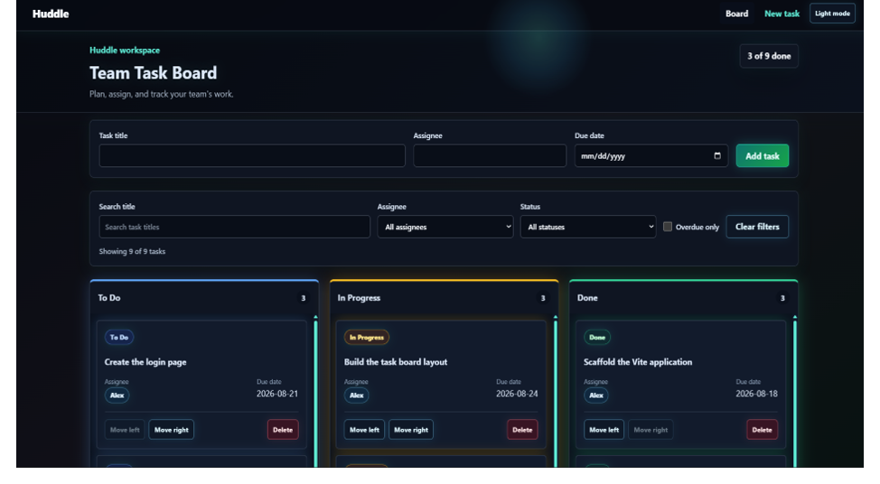
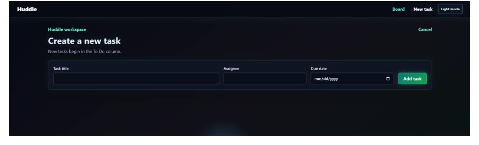
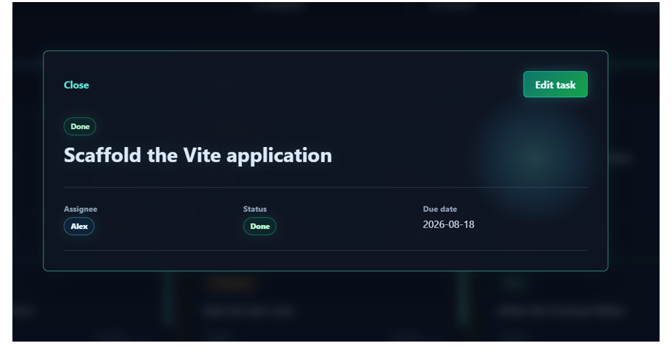
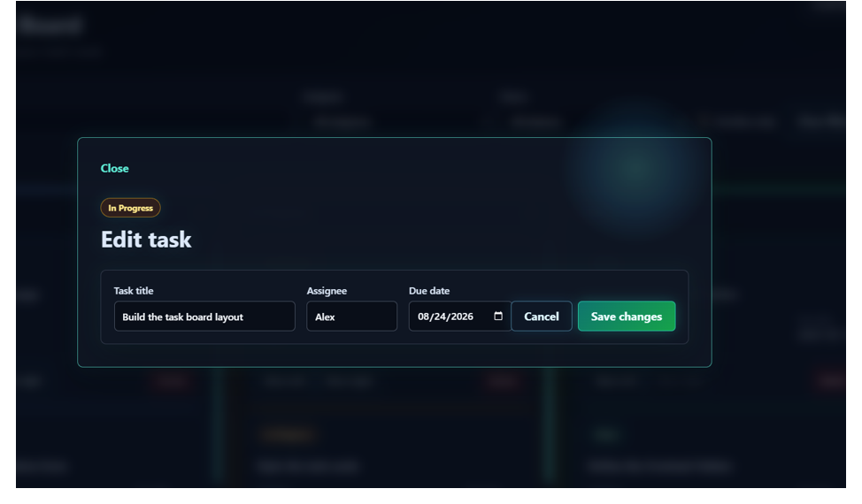
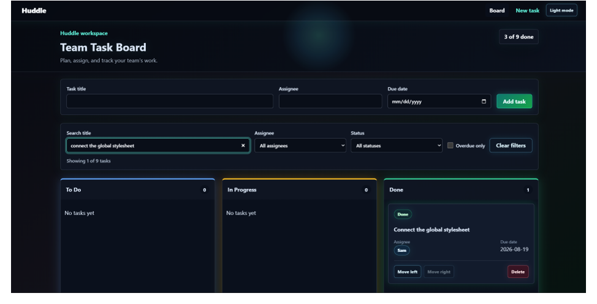
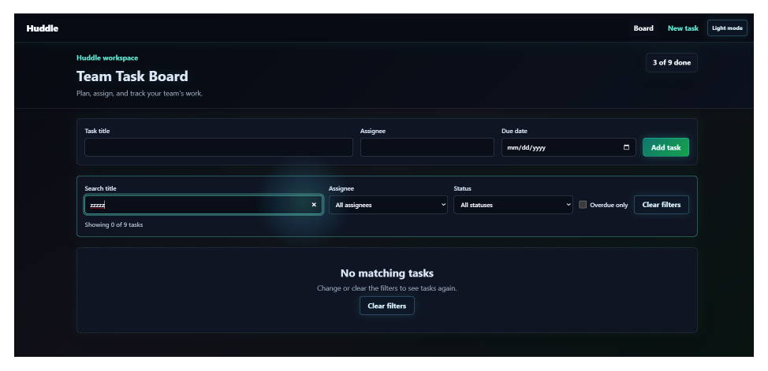
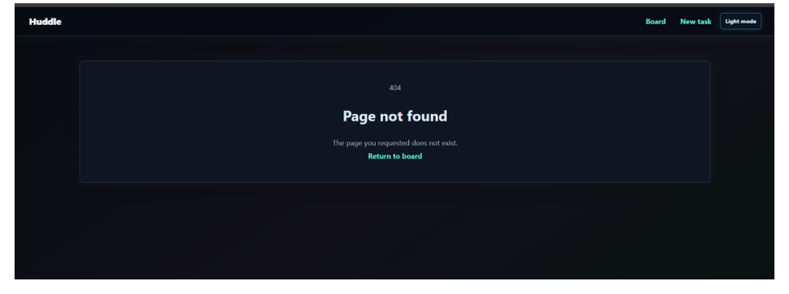

# Huddle

## Assignment 01 Front-End Client

Huddle is a collaborative task board for small teams to create, assign, filter, move, edit, and delete tasks. The current repository is aligned with the Assignment 01 / Session 1 front-end scope: a Vite + React client that uses mock data and front-end state.

This version intentionally focuses on the React front end. Backend APIs, authentication, database persistence, real-time sync, automated tests, CI, Docker, and deployment are planned for later milestones.

## Current Status

- The `main` branch contains the merged Assignment 01 front-end foundation.
- Charles's reusable `Button` component work has been merged.
- Vinuka's task search and filtering work has been merged.
- The app builds successfully with `npm run build`.

## Assignment 02 Server-Side Progress

This branch starts the Session 2 backend work for the SyncBoard API using Node.js and Express. The implementation follows the lecture architecture by separating server startup, Express app setup, routes, controllers, services, repositories, middleware, and server-side data.

Current backend progress:

- Express server foundation added.
- Environment configuration added through `.env.example` and `server/config.js`.
- `server/server.js` starts the API process.
- `server/app.js` builds the Express app and middleware chain.
- `GET /api/health` returns API status and uptime.
- `GET /api/tasks` returns task data with a consistent `{ data, meta }` response shape.
- `GET /api/tasks/:id` returns one task by id.
- Missing task ids return `404` with a consistent `{ error }` response shape.
- Task listing supports `status`, `assignee`, `sort`, `page`, and `limit` query parameters.
- Request ID and request logger middleware are registered in the middleware chain.

Assignment 02 is in progress on the `feature/session-02-backend-foundation` branch. Authentication, ownership checks, write validation, full task CRUD, Postman evidence, and frontend live API integration are still pending.

### Session 2 API Contract

| Method & path | Purpose | Success | Errors |
|---|---|---|---|
| POST `/api/auth/register` | Create an account | 201 + user | 400, 409 |
| POST `/api/auth/login` | Exchange credentials for a token | 200 + token | 400, 401 |
| GET `/api/auth/me` | Current user from the token | 200 + user | 401 |
| GET `/api/boards` | Boards this user can see | 200 + array | 401 |
| POST `/api/boards` | Create a board | 201 + board | 400, 401 |
| GET `/api/boards/:id/tasks` | Tasks on a board, filterable | 200 + array | 401, 403, 404 |
| GET `/api/tasks` | List tasks, filterable/sortable/pageable | 200 + array | 400, 401 |
| GET `/api/tasks/:id` | Read one task | 200 + task | 401, 403, 404 |
| POST `/api/tasks` | Create a task | 201 + task | 400, 401, 403 |
| PATCH `/api/tasks/:id` | Update fields, including status | 200 + task | 400, 401, 403, 404 |
| DELETE `/api/tasks/:id` | Remove a task | 204 | 401, 403, 404 |

## Tech Stack

- React
- Vite
- React Router
- Context API and `useReducer`
- JavaScript
- CSS Modules for the shared button component
- Global CSS for the application layout and responsive styling
- Mock task API backed by local data

## Implemented Features

- Three-column task board for `To Do`, `In Progress`, and `Done`.
- Sticky navigation and board summary header while scrolling.
- Mock tasks loaded through an isolated API module.
- Loading, error, retry, empty, and success feedback states.
- Controlled form for adding tasks.
- Validation for required fields, minimum title length, and past due dates.
- Task detail route with validated editing.
- Task detail modal over a blurred board background.
- Immutable task movement between columns.
- Delete confirmation before removing tasks.
- Independent scrolling inside each board column.
- Colored status and assignee pills on task cards and task details.
- Search by task title.
- Filter by assignee, status, and overdue tasks.
- Filter state stored in the URL query string.
- Clear-filters action and no-results state.
- Shared task state managed through Context and reducer actions.
- Reusable `Button` component for consistent button styling.
- Dark theme with glowing cards, buttons, and cursor movement feedback.
- Light theme with blue cursor glow and blue frame glow on hover.
- Route handling for board, new task, task detail/edit, and 404 pages.

## Team Contributions

- T D Gnanasena: repository scope alignment, Vite React setup, board foundation, routing, shared task state, task actions, validation, edit flow, integration, README, and final UI polish.
- J Charles: reusable `Button` component and shared button styling.
- K V Dilnath: task search, filter utilities, filter UI, URL query state, result counts, and no-results flow.
- R S Boklagama: joined during the finalization stage and supported report finalization, screenshot/resource gathering, and layout/color palette review. His development contribution will begin from the next milestone.

## Local Development

Requirements: Node.js and npm.

Install dependencies:

```powershell
npm install
```

Start the local development server:

```powershell
npm run dev
```

Vite usually serves the app at `http://localhost:5173/`. If that port is busy, Vite will print the new local URL in the terminal.

Create a production build:

```powershell
npm run build
```

Preview the production build locally:

```powershell
npm run preview
```

## Routes

```text
/             Board page
/tasks/new    New task page
/tasks/:id    Task detail and edit page
*             Not found page
```

## Project Structure

```text
src/
+-- api/
|   +-- tasks.js
+-- components/
|   +-- AddTaskForm.jsx
|   +-- AppNavigation.jsx
|   +-- Board.jsx
|   +-- Button/
|   |   +-- Button.jsx
|   |   +-- Button.module.css
|   +-- Column.jsx
|   +-- CursorGlow.jsx
|   +-- EditTaskForm.jsx
|   +-- ErrorState.jsx
|   +-- LoadingState.jsx
|   +-- TaskCard.jsx
|   +-- TaskFilters.jsx
+-- context/
|   +-- TasksContext.js
|   +-- TasksProvider.jsx
+-- data/
|   +-- mockTasks.js
+-- hooks/
|   +-- useTasks.js
+-- pages/
|   +-- BoardPage.jsx
|   +-- NewTaskPage.jsx
|   +-- NotFoundPage.jsx
|   +-- TaskDetailPage.jsx
+-- utils/
|   +-- filterTasks.js
|   +-- tasksReducer.js
+-- App.jsx
+-- index.css
+-- main.jsx
```

## Component Tree

```text
App
+-- BrowserRouter
    +-- TasksProvider
        +-- AppNavigation
        +-- Routes
            +-- BoardPage
            |   +-- AddTaskForm
            |   +-- TaskFilters
            |   +-- Board
            |       +-- Column
            |           +-- TaskCard
            +-- NewTaskPage
            |   +-- AddTaskForm
            +-- TaskDetailPage
            |   +-- EditTaskForm
            +-- NotFoundPage
```

## Application Screenshots

These screenshots show the running Assignment 01 Vite app, not the early wireframe mockups.

### Board Dashboard



The board dashboard shows Huddle's main workflow with sticky navigation, a progress summary, task creation, search/filter controls, and the three required task columns.

### Create Task Page



The create task route shows the controlled form used to add new tasks into the board.

### Task Detail Modal



The detail route opens a selected task as a focused modal while keeping the board visible behind a blur.

### Edit Task Form



The edit state allows task title, assignee, and due date updates through the same shared task state.

### Search and Filter State



The filtered board shows search input, matching task counts, and reduced task results.

### No Matching Tasks State



The no-results state gives a clear message and a recovery action when filters match no tasks.

### 404 Page



The catch-all route displays a not-found page and provides a return path to the board.

## Wireframes / Visual Mockups

The existing images are kept as planning wireframes and visual reference material. They can be used as design frameworks for explaining the intended interface, but the final proof screenshots are listed in the Application Screenshots section above.

### Kanban Board


### Create Task Flow


### Task Detail Flow


### Edit Task Flow


### Auth Planning Screens


## Manual Verification Checklist

- Install dependencies with `npm install`.
- Confirm the production build passes with `npm run build`.
- Load the board and confirm mock tasks appear in the correct columns.
- Add a valid task and confirm it appears on the board.
- Try invalid task data and confirm validation messages appear.
- Move tasks between `To Do`, `In Progress`, and `Done`.
- Delete a task and confirm the browser asks for confirmation.
- Open a task detail page.
- Edit a task and confirm the updated values are shown.
- Use title search and assignee, status, and overdue filters.
- Refresh the page with filters active and confirm query-string filters remain.
- Clear filters and confirm all tasks return.
- Visit an unknown route and confirm the 404 page appears.

## Current Limitations

- Tasks are loaded from mock data instead of a real backend.
- Changes are stored in front-end state only and reset when the page reloads.
- Authentication and user accounts are not implemented in this milestone.
- Database persistence is not implemented in this milestone.
- Real-time updates are not implemented in this milestone.
- Automated tests, CI, Docker, and public deployment are not part of the current submission.

## Future Milestones

- Add an Express API for task and user data.
- Add MongoDB persistence.
- Add authentication and protected routes.
- Connect the React client to the backend API.
- Add automated tests and CI checks.
- Add deployment documentation.
