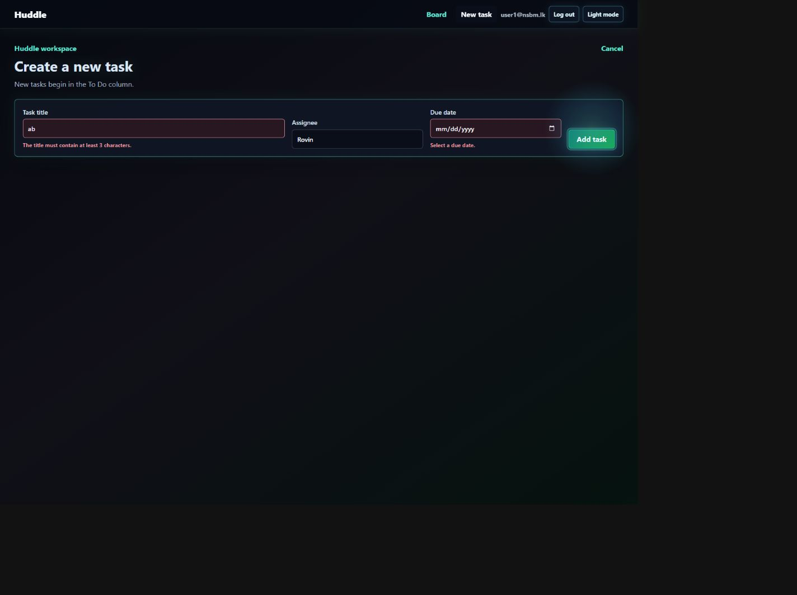
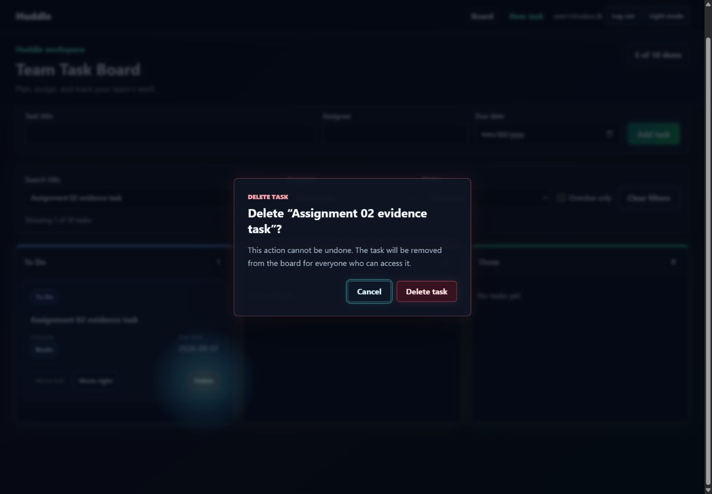
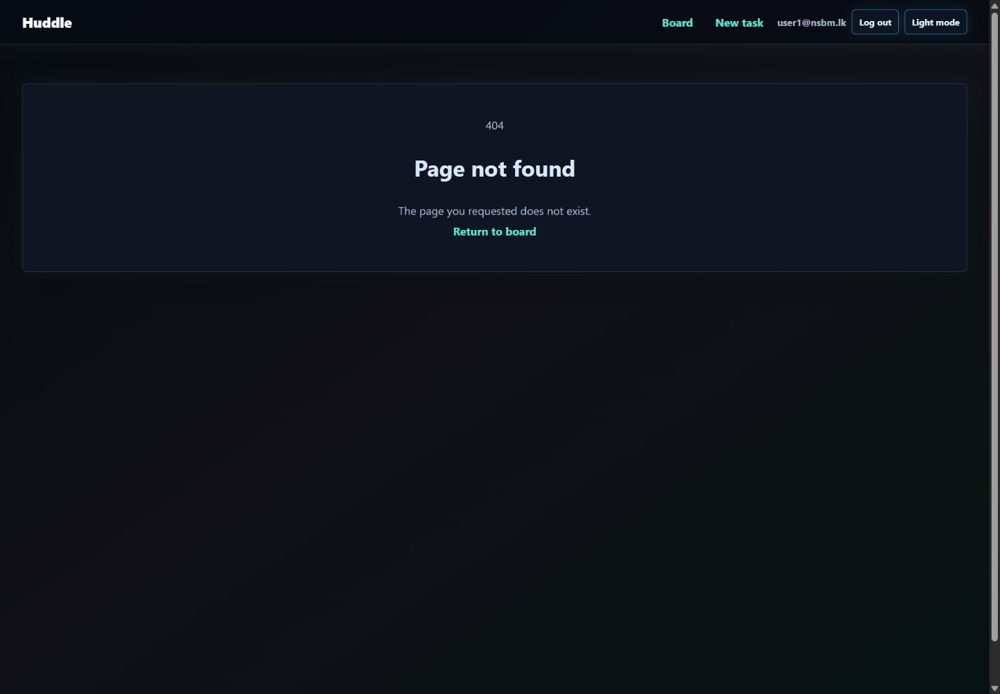
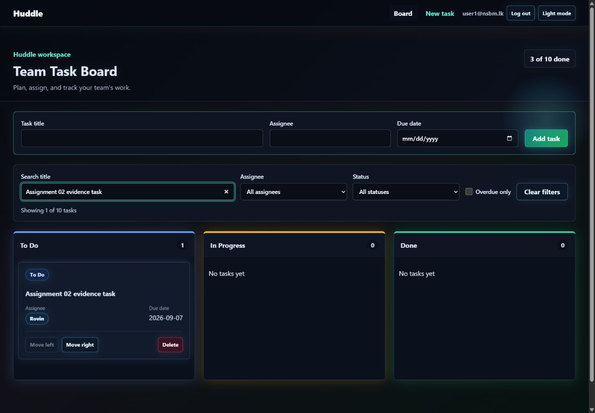

# Huddle

Huddle is a collaborative task board built progressively across five full-stack milestones. Assignment 03 combines the React client, Express API, MongoDB persistence through Mongoose, browser persistence through PouchDB, and version-based conflict handling.

Repository: [github.com/Dew3120/huddle](https://github.com/Dew3120/huddle)

Assignment 02 release tag: `assignment-02-working-rest-api`

Assignment 03 final tag: `assignment-03-working-full-stack-application` (created after the final merge and Atlas evidence are complete)

## Table of Contents

- [Milestone Status](#milestone-status)
- [Assignment 02 Highlights](#assignment-02-highlights)
- [Architecture](#architecture)
- [Milestone 3 Data Model](#milestone-3-data-model)
- [Technology Stack](#technology-stack)
- [Quick Start](#quick-start)
- [API Documentation](#api-documentation)
- [API Contract](#api-contract)
- [Response Contract](#response-contract)
- [Authentication and Security Decisions](#authentication-and-security-decisions)
- [Frontend Integration](#frontend-integration)
- [Offline Synchronization](#offline-synchronization)
- [Application Routes](#application-routes)
- [Project Structure](#project-structure)
- [Assignment 02 Evidence](#assignment-02-evidence)
- [Assignment 03 Evidence](#assignment-03-evidence)
- [Postman Evidence Index](#postman-evidence-index)
- [Team Roles and Contributions](#team-roles-and-contributions)
- [Verification Guide](#verification-guide)
- [Known Limitations](#known-limitations)
- [Release Tag](#release-tag)
- [Roadmap](#roadmap)

## Milestone Status

| Milestone          | Deliverable                                                | Status                                                           |
| ------------------ | ---------------------------------------------------------- | ---------------------------------------------------------------- |
| Assignment 01 / M1 | Static React front-end skeleton                            | Complete and tagged as `assignment-01-static-front-end-skeleton` |
| Assignment 02 / M2 | Working REST API with mock data integrated with the client | Complete and tagged as `assignment-02-working-rest-api`          |
| Assignment 03 / M3 | MongoDB persistence, offline support, and conflict handling | Implementation verified locally; Atlas Free setup and final tag pending |
| M4                 | Automated client/server tests and CI                       | Planned                                                          |
| M5                 | Real-time sync, Docker, deployment, and final launch       | Planned                                                          |

The tagged Assignment 02 release intentionally keeps server data in memory. The current Assignment 03 branch uses MongoDB through Mongoose and keeps the Assignment 02 tag unchanged for marking.

## Assignment 02 Highlights

- Responsive React task board with sign in, sign up, logout, and session restore.
- Live client integration through a centralized `fetch` wrapper and Vite `/api` proxy.
- Express REST API with routes, controllers, services, repositories, schemas, and middleware.
- Password hashing with `bcryptjs`; password hashes are never serialized to clients.
- One-hour signed JWT access tokens and protected auth, board, and task routes.
- Ownership checks in the service layer so users cannot access another user's resources.
- Full task CRUD with `201`, `200`, and `204` success responses.
- Board listing, board creation, and board-specific task listing.
- Zod validation on every write endpoint with per-field validation details.
- Consistent operational error responses and generic unexpected `500` responses.
- Filtering, sorting, and pagination for task collections, including board task collections.
- Swagger UI, OpenAPI 3.1 YAML/JSON, and an exported Postman collection.
- Saved evidence for success, authentication, validation, ownership, not-found, and delete flows.

## Architecture

```text
React page/component
        |
        v
src/api client  -- Authorization: Bearer <JWT> -->  Express route
                                                        |
                                                        v
                                                   Controller
                                                        |
                                                        v
                                                    Service
                                             validation/ownership/querying
                                                        |
                                                        v
                                                   Repository
                                                        |
                                                        v
                                                  Mongoose models
                                                        |
                                                        v
                                                     MongoDB
```

The controller is the HTTP boundary. It reads `req`, calls a service, and shapes the response. Services hold business rules, ownership checks, filtering, sorting, and pagination. Repositories own data access. No `req` or `res` object is passed below the controller layer.

The middleware order in `server/app.js` is deliberate: request IDs and logging, security and CORS, JSON parsing, public authentication routes with rate limiting on login, protected board/task routes, the catch-all 404 handler, and finally the central error handler.

## Milestone 3 Data Model

Huddle models documents from the application reads they must support. The main screen loads an owned board and a filterable, sortable, paginated task collection. Tasks change much more frequently than board metadata and can grow without a practical fixed limit, so tasks remain separate documents rather than an unbounded array embedded inside a board.

| Data              | Embed or reference decision                                  | Reason                                                                                                  |
| ----------------- | ------------------------------------------------------------ | ------------------------------------------------------------------------------------------------------- |
| Users             | Separate collection; referenced from boards and tasks        | Users are authenticated and queried independently, and one user can own or join several boards.         |
| Boards            | Separate collection                                           | A board has its own identity, ownership boundary, and independently loaded summary.                     |
| Board columns     | Embed inside the board document                              | The three columns are small, bounded, and always read with the board.                                        |
| Tasks             | Separate collection; reference a board with `boardId`        | Tasks are numerous, updated often, and queried independently by status, assignee, sort order, and page. |
| Task ownership    | Resolve through `boardId` and the board owner or members      | The board remains the source of truth for access instead of duplicating membership on every task.       |
| Activity entries  | Separate collection; reference the board, task, and user      | Activity grows continuously and should not enlarge the board or task document on every change.          |

The current repositories use Mongoose. Boards embed their small, fixed column list, while tasks store a `boardId` reference and remain independently queryable. Task filtering, sorting, pagination, ownership checks, counts, creation, updates, and deletion now run against MongoDB. The files in `server/data` provide repeatable demo seed values and are no longer the runtime data store.

The task model declares indexes for the board screen, overdue queries, assignee status queries, and text search. The user model enforces one account per email with a unique index. A local explain plan reports `IXSCAN` for the indexed board query.

## Technology Stack

| Layer              | Technology                                                  |
| ------------------ | ----------------------------------------------------------- |
| Client             | React 19, React Router, Context API, `useReducer`, Vite     |
| Client persistence | PouchDB over IndexedDB with a user-scoped mutation queue    |
| API                | Node.js, Express 5                                          |
| Validation         | Zod                                                         |
| Authentication     | `bcryptjs`, `jsonwebtoken`, `express-rate-limit`            |
| Security           | Helmet, configured CORS, generic `500` responses            |
| API reference      | OpenAPI 3.1, Swagger UI, Postman collection                 |
| Styling            | Global responsive CSS and CSS Modules for the shared button |
| Current data layer | MongoDB 8 with Mongoose models and repositories             |

## Quick Start

### Prerequisites

- Node.js 20 or newer
- npm
- Git
- MongoDB Community Server 8 or an Atlas connection string
- Optional: Postman for running the saved API collection

### 1. Clone and install

```powershell
git clone https://github.com/Dew3120/huddle.git
cd huddle
git switch feature/session-03-client-persistence
npm ci
```

### 2. Configure the API

Create `.env` from the committed example:

```powershell
Copy-Item .env.example .env
```

For local development, use:

```env
PORT=4000
JWT_SECRET=replace-this-with-a-long-random-development-secret
CLIENT_ORIGIN=http://localhost:5173
MONGODB_URI=mongodb://127.0.0.1:27017/huddle
```

For Atlas, replace only `MONGODB_URI` with the connection string copied from Atlas. Keep the database user password inside the URI private. Never commit `.env`, a real JWT secret, or an Atlas connection string.

### 3. Seed the development database

Make sure MongoDB is running, then load the demo users, boards, and tasks:

```powershell
npm run seed
```

The seed command is repeatable. It updates the named demo records without deleting unrelated development data.

### 4. Start the backend

Open PowerShell terminal 1:

```powershell
npm run dev:server
```

The API runs at `http://localhost:4000`.

### 5. Start the frontend

Open PowerShell terminal 2:

```powershell
npm run dev
```

Open the URL printed by Vite, normally `http://localhost:5173`.

### 6. Sign in

```text
Email: user1@nsbm.lk
Password: password123
```

You can also create a new account from the Sign up tab. Accounts, boards, and tasks remain available after the API restarts.

### Production build

```powershell
npm test
npm run build
npm run preview
```

Use `npm run preview` when demonstrating the offline app-shell cache. The development server is useful for normal API work; the production preview is the verified path for service-worker caching.

### Atlas Free Database setup

1. Create or open the group project in [MongoDB Atlas](https://www.mongodb.com/atlas/database).
2. Create an M0 Free cluster and a database user for this application.
3. In Network Access, add the developer machine's current IP address.
4. Select **Connect > Drivers**, choose Node.js, and copy the URI.
5. Put the URI in the local `.env` as `MONGODB_URI`, then run `npm run seed` and start the API.
6. Confirm `GET /api/health` reports `database.status` as `connected` before taking the Atlas/Compass screenshots.

Do not put Atlas credentials in GitHub, the report, screenshots, Postman variables, or chat messages. The final submission should include the Atlas project/cluster evidence without exposing the password.

## API Documentation

Start the backend, then use either reference:

- Interactive Swagger UI: [http://localhost:4000/api/docs/](http://localhost:4000/api/docs/)
- OpenAPI JSON: [http://localhost:4000/api/openapi.json](http://localhost:4000/api/openapi.json)
- Source contract: [`docs/openapi.yaml`](docs/openapi.yaml)
- Postman collection: [`docs/api-evidence/Huddle Assignment 02 API Evidence.postman_collection.json`](docs/api-evidence/Huddle%20Assignment%2002%20API%20Evidence.postman_collection.json)

The Postman collection uses collection variables for `baseUrl`, `token`, and `taskId`. Login stores the returned JWT automatically, and task creation stores the new task ID for later PATCH and DELETE requests.

## API Contract

| Method and path             | Authentication | Purpose                        | Success | Common errors       |
| --------------------------- | -------------- | ------------------------------ | ------- | ------------------- |
| `GET /api/health`           | Public         | API health and uptime          | `200`   | `500`               |
| `POST /api/auth/register`   | Public         | Create an account              | `201`   | `400`, `409`        |
| `POST /api/auth/login`      | Public         | Exchange credentials for a JWT | `200`   | `400`, `401`, `429` |
| `GET /api/auth/me`          | Bearer JWT     | Return the current user        | `200`   | `401`               |
| `GET /api/boards`           | Bearer JWT     | List the user's boards         | `200`   | `401`               |
| `POST /api/boards`          | Bearer JWT     | Create a board                 | `201`   | `400`, `401`        |
| `GET /api/boards/:id/tasks` | Bearer JWT     | List tasks on an owned board   | `200`   | `400`, `401`, `404` |
| `GET /api/tasks`            | Bearer JWT     | List tasks                     | `200`   | `400`, `401`        |
| `GET /api/tasks/:id`        | Bearer JWT     | Read one task                  | `200`   | `401`, `404`        |
| `POST /api/tasks`           | Bearer JWT     | Create a task                  | `201`   | `400`, `401`        |
| `PATCH /api/tasks/:id`      | Bearer JWT     | Update task fields or status   | `200`   | `400`, `401`, `404`, `409` |
| `DELETE /api/tasks/:id`     | Bearer JWT     | Delete a task                  | `204`   | `401`, `404`        |

Task collection query parameters:

| Parameter  | Values                                                                   | Behavior                         |
| ---------- | ------------------------------------------------------------------------ | -------------------------------- |
| `status`   | `todo`, `in-progress`, `done`                                            | Exact status filter              |
| `assignee` | Text                                                                     | Case-insensitive assignee filter |
| `sort`     | `title`, `assignee`, `status`, `dueDate`; prefix with `-` for descending | Stable collection sort           |
| `page`     | Positive integer                                                         | Requested result page            |
| `limit`    | `1` to `100`                                                             | Results per page                 |

The same query behavior is available on `GET /api/boards/:id/tasks`.

## Response Contract

Collection success:

```json
{
  "data": [],
  "meta": {
    "page": 1,
    "limit": 20,
    "total": 0
  }
}
```

Single-resource success:

```json
{
  "data": {
    "id": "task-001"
  }
}
```

Error response:

```json
{
  "error": {
    "message": "Task not found",
    "code": "TASK_NOT_FOUND",
    "requestId": "request-correlation-id"
  }
}
```

Validation errors also include `error.details`. Unexpected server errors return the generic message `Something went wrong` with code `INTERNAL_ERROR`; stack traces and internal exception messages are not sent to the client.

## Authentication and Security Decisions

### Why localStorage was chosen

Assignment 02 uses an access token in `localStorage` because this milestone requires a simple React-to-Express bearer-token flow that survives a page refresh. The centralized API client reads one token, attaches one `Authorization` header, and clears the session after any `401`. This keeps the workshop implementation small and observable in Postman and browser developer tools.

This is a milestone tradeoff, not the strongest production design. JavaScript can read `localStorage`, so a successful cross-site scripting attack could steal the token. Huddle reduces the exposure window with a short-lived token, avoids placing secrets in the JWT payload, and keeps the token handling in one client module.

### Why the JWT expires after one hour

One hour balances workshop usability with risk. It is long enough to complete a normal development or demonstration session without repeated logins, while a leaked token stops working automatically after a bounded period. Tokens that never expire are deliberately avoided.

### What changes in a later production version

A production version would use a short-lived access token plus a rotating refresh token stored in a `Secure`, `httpOnly`, `SameSite` cookie. JavaScript could not read the refresh token. The server would persist refresh-token identifiers, rotate them on use, revoke them on logout or suspected reuse, and issue new access tokens through a dedicated refresh endpoint. Cookie authentication would also require explicit credential-aware CORS configuration and CSRF protection. Secrets would come from the deployment platform, never Git.

## Frontend Integration

- `src/api/client.js` owns base URL selection, JSON headers, JWT attachment, error conversion, `204` handling, and central `401` expiry behavior.
- `src/api/auth.js` contains register, login, and current-user requests.
- `src/api/tasks.js` contains live task CRUD calls. No component imports mock task data.
- `AuthProvider` restores the token-backed session and keeps the public user profile available during an offline refresh.
- `TasksProvider` renders cached tasks first, refreshes them from the API, queues offline task writes, and exposes synchronization state.
- Loading, empty, validation, network-error, and retry states are driven by real HTTP behavior.
- Vite proxies `/api` to `http://localhost:4000` during development; Express also has environment-controlled CORS for deployed origins.

## Offline Synchronization

Each signed-in user receives a separate PouchDB database in IndexedDB. Server tasks are cached without PouchDB metadata, and queued create, update, and delete mutations are compacted so repeated offline edits do not produce unnecessary requests. The board renders immediately from this cache and continues to support task changes when the API or network is unavailable.

When connectivity returns, Huddle replays pending mutations and refreshes the cache from MongoDB. Task updates include the version last seen by the browser. The server performs the version check and update atomically; a stale write returns `409 TASK_CONFLICT` with the current task. The interface then lets the user keep the server version or deliberately retry their own changes against the current version. Pending, failed, and conflicting tasks remain visible instead of silently losing an edit.

## Application Routes

| Client route      | Purpose                  |
| ----------------- | ------------------------ |
| `/`               | Authenticated task board |
| `/tasks/new`      | Create-task screen       |
| `/tasks/:id`      | Task detail modal        |
| `/tasks/:id/edit` | Task edit modal          |
| `*`               | Client not-found screen  |

Unauthenticated users see the combined Sign in / Sign up screen before protected application routes are rendered.

## Project Structure

```text
huddle/
+-- docs/
|   +-- api-evidence/
|   |   +-- Huddle Assignment 02 API Evidence.postman_collection.json
|   |   +-- 01-health-200.png ... 20-task-delete-204.png
|   +-- screenshots/
|   |   +-- assignment-02/
|   |       +-- 01-sign-in-live-api.png ... 13-created-task-on-board.png
|   |   +-- assignment-03/
|   |       +-- 01-sign-in.png ... 21-backend-health-response.png
|   +-- openapi.yaml
+-- server/
|   +-- app.js
|   +-- config.js
|   +-- openapi.js
|   +-- server.js
|   +-- db/
|   |   +-- connect.js
|   |   +-- seed.js
|   +-- controllers/
|   |   +-- authController.js
|   |   +-- boardController.js
|   |   +-- taskController.js
|   +-- data/
|   |   +-- boards.js
|   |   +-- tasks.js
|   +-- models/
|   |   +-- Board.js
|   |   +-- Task.js
|   |   +-- User.js
|   +-- middleware/
|   |   +-- authenticate.js
|   |   +-- errorHandler.js
|   |   +-- requestId.js
|   |   +-- requestLogger.js
|   |   +-- validate.js
|   +-- repositories/
|   |   +-- boardRepository.js
|   |   +-- taskRepository.js
|   |   +-- userRepository.js
|   +-- routes/
|   |   +-- authRoutes.js
|   |   +-- boardRoutes.js
|   |   +-- taskRoutes.js
|   +-- schemas/
|   |   +-- authSchema.js
|   |   +-- boardSchema.js
|   |   +-- taskSchema.js
|   +-- services/
|   |   +-- authService.js
|   |   +-- boardService.js
|   |   +-- taskService.js
|   +-- utils/
|       +-- AppError.js
|       +-- asyncHandler.js
|       +-- resourceId.js
|       +-- taskCollection.js
+-- src/
|   +-- api/
|   |   +-- auth.js
|   |   +-- client.js
|   |   +-- tasks.js
|   +-- components/
|   |   +-- Button/
|   |   +-- AddTaskForm.jsx
|   |   +-- AppNavigation.jsx
|   |   +-- Board.jsx
|   |   +-- Column.jsx
|   |   +-- DeleteTaskDialog.jsx
|   |   +-- EditTaskForm.jsx
|   |   +-- TaskCard.jsx
|   |   +-- TaskFilters.jsx
|   |   +-- SyncStatusBar.jsx
|   +-- context/
|   |   +-- AuthProvider.jsx
|   |   +-- TasksProvider.jsx
|   +-- db/
|   |   +-- taskCache.js
|   +-- hooks/
|   +-- pages/
|   +-- services/
|   |   +-- taskSynchronization.js
|   +-- utils/
|   +-- App.jsx
|   +-- index.css
|   +-- main.jsx
+-- .env.example
+-- package.json
+-- vite.config.js
```

## Assignment 02 Evidence

All current UI images were captured against the live Express API, not local mock tasks.

### Authentication

| Sign in                                                                                             | Sign up                                                                                             |
| --------------------------------------------------------------------------------------------------- | --------------------------------------------------------------------------------------------------- |
|  |  |

### Live task workflows


| Create task                                                                                            | Task detail                                                                                    |
| ------------------------------------------------------------------------------------------------------ | ---------------------------------------------------------------------------------------------- |
|  |  |

| Edit task                                                                                          | Server-backed status filter                                                                           |
| -------------------------------------------------------------------------------------------------- | ----------------------------------------------------------------------------------------------------- |
|  |  |

| Validation feedback                                                                                               | Delete confirmation                                                                                          |
| ----------------------------------------------------------------------------------------------------------------- | ------------------------------------------------------------------------------------------------------------ |
|  |  |

| Current 404 screen                                                                                | Successful live task creation                                                                                                |
| ------------------------------------------------------------------------------------------------- | ---------------------------------------------------------------------------------------------------------------------------- |
|  |  |

### Backend reference and health

| Swagger task API reference                                                                                                | Executed health response                                                                                                     |
| ------------------------------------------------------------------------------------------------------------------------- | ---------------------------------------------------------------------------------------------------------------------------- |
|  |  |

## Assignment 03 Evidence

The Assignment 03 evidence folder contains the frontend workflow, PouchDB offline/reconnect states, conflict-resolution state, backend verification captures, and MongoDB Compass view:

- [`docs/screenshots/assignment-03/`](docs/screenshots/assignment-03/) contains the numbered screenshot set used by the report.
- [`17-backend-task-stats.png`](docs/screenshots/assignment-03/17-backend-task-stats.png) shows the aggregation response grouped by status and overdue assignee.
- [`18-backend-conflict-response.png`](docs/screenshots/assignment-03/18-backend-conflict-response.png) shows the `409 TASK_CONFLICT` response from an optimistic-concurrency test.
- [`19-mongodb-compass-tasks.png`](docs/screenshots/assignment-03/19-mongodb-compass-tasks.png) shows persisted task documents in MongoDB Compass.
- [`20-swagger-api-reference.png`](docs/screenshots/assignment-03/20-swagger-api-reference.png) and [`21-backend-health-response.png`](docs/screenshots/assignment-03/21-backend-health-response.png) show the API documentation and connected backend health response.

Atlas-specific screenshots are added after the Atlas Free cluster is created and the application is pointed at it.

## Postman Evidence Index

The committed collection and screenshots form a repeatable manual API test suite.

| File                                                                               | Evidence                                          |
| ---------------------------------------------------------------------------------- | ------------------------------------------------- |
| [`01-health-200.png`](docs/api-evidence/01-health-200.png)                         | Public health endpoint returns `200`              |
| [`02-register-success-201.png`](docs/api-evidence/02-register-success-201.png)     | Registration returns `201` and public user data   |
| [`03-register-duplicate-409.png`](docs/api-evidence/03-register-duplicate-409.png) | Duplicate email returns `409 EMAIL_EXISTS`        |
| [`04-login-200.png`](docs/api-evidence/04-login-200.png)                           | Login returns a one-hour JWT                      |
| [`05-current-user-200.png`](docs/api-evidence/05-current-user-200.png)             | Protected current-user request returns `200`      |
| [`06-tasks-no-token-401.png`](docs/api-evidence/06-tasks-no-token-401.png)         | Missing bearer token returns `401 NO_TOKEN`       |
| [`07-tasks-bad-token-401.png`](docs/api-evidence/07-tasks-bad-token-401.png)       | Invalid token returns `401 BAD_TOKEN`             |
| [`08-tasks-list-200.png`](docs/api-evidence/08-tasks-list-200.png)                 | Authenticated task list returns data and metadata |
| [`09-task-filter-200.png`](docs/api-evidence/09-task-filter-200.png)               | Collection query returns filtered tasks           |
| [`10-boards-list-200.png`](docs/api-evidence/10-boards-list-200.png)               | Authenticated board list returns `200`            |
| [`11-board-create-201.png`](docs/api-evidence/11-board-create-201.png)             | Board creation returns `201`                      |
| [`12-board-tasks-200.png`](docs/api-evidence/12-board-tasks-200.png)               | Board task collection returns `200`               |
| [`13-board-ownership-404.png`](docs/api-evidence/13-board-ownership-404.png)       | Another user's board is concealed with `404`      |
| [`14-task-create-201.png`](docs/api-evidence/14-task-create-201.png)               | Valid task creation returns `201`                 |
| [`15-task-validation-400.png`](docs/api-evidence/15-task-validation-400.png)       | Invalid title returns field-level `400` details   |
| [`16-task-detail-200.png`](docs/api-evidence/16-task-detail-200.png)               | Owned task detail returns `200`                   |
| [`17-task-update-200.png`](docs/api-evidence/17-task-update-200.png)               | Task update returns `200`                         |
| [`18-task-not-found-404.png`](docs/api-evidence/18-task-not-found-404.png)         | Missing task returns `404 TASK_NOT_FOUND`         |
| [`19-task-ownership-404.png`](docs/api-evidence/19-task-ownership-404.png)         | Another user's task is concealed with `404`       |
| [`20-task-delete-204.png`](docs/api-evidence/20-task-delete-204.png)               | Task deletion returns `204` with no body          |

## Team Roles and Contributions

| Team member | Assignment 03 role and contribution |
| ----------- | ----------------------------------- |
| T D Gnanasena (NSBM 36407) | Project coordination, MongoDB/Mongoose integration, authentication and CRUD persistence, integration of the client-persistence branches, PWA/offline completion, README, report, and release preparation. |
| J Charles (NSBM 36359) | Assignment 03 verification contribution: reproducible persistence/conflict verification script, test/build/audit checks, and clean verification branch history. |
| K V Dilnath (NSBM 33700) | PouchDB browser cache and user-scoped task persistence, including loading cached tasks before refresh and the client-persistence branch contribution. |
| R S Bokalagama (NSBM 37412) | Aggregation endpoint and optimistic task-concurrency behavior, including stale-version conflict evidence and API statistics verification. Plymouth ID was not provided. |

The repository uses feature branches and pull requests so individual contributions remain visible in Git history. Do not squash or rewrite that history before submission.

## Verification Guide

### Build and contract checks

```powershell
npm install
npm test
npm run build
npm audit
npm run verify:assignment-02
npm run verify:assignment-03
```

With the API running:

```powershell
curl.exe http://localhost:4000/api/health
curl.exe -I http://localhost:4000/api/docs/
curl.exe http://localhost:4000/api/openapi.json
```

### Manual end-to-end checks

1. Register a new user and confirm the response does not expose a password hash.
2. Log in and confirm the response contains a token and public user data.
3. Call `/api/auth/me` with the token and receive `200`.
4. Call `/api/tasks` without a token and receive `401 NO_TOKEN`.
5. Load the React board and confirm live tasks appear in the correct columns.
6. Create, read, update, move, and delete a task.
7. Submit an invalid two-character title and confirm field-level `400` details render.
8. Filter by status and assignee, sort by due date, and verify pagination metadata.
9. Query `/api/boards/:id/tasks` with the same filters.
10. Request another user's board/task and confirm the API conceals it with `404`.
11. Log out and confirm the protected client returns to the authentication screen.
12. Import and run the committed Postman collection as the saved API contract evidence.
13. Load the board once, stop the API, move or edit a task, and refresh the browser; confirm the cached task and `Pending sync` state remain visible.
14. Restart the API and select `Try reconnecting`; confirm the pending marker clears and MongoDB contains the update.
15. Update the same task from two clients with the same starting version; confirm the stale client receives `409 TASK_CONFLICT` and can keep the server copy or apply its own changes.

The repeatable verification commands report `17/17` Assignment 02 checks and `9/9` Assignment 03 checks when the API is connected to the seeded MongoDB database. The current client test suite covers PouchDB cache replacement, mutation compaction, offline creates/updates/deletes, network failures, mergeable edits, and visible same-field conflicts.

## Known Limitations

- The local evidence was verified against MongoDB Community Server. Atlas Free setup and its final screenshots are still pending until the team creates the cluster and updates the local `.env`.
- The current ownership model gives each seeded board one owner. Multi-member board roles and invitations are later domain work.
- Access tokens are stored in `localStorage`; refresh tokens, rotation, revocation, CSRF protection, and cookie-based sessions are not part of M2.
- Automated client/server tests and GitHub Actions are M4 deliverables.
- WebSocket updates, Docker Compose, and public deployment are M5 deliverables.
- The committed Postman collection remains the primary manual API evidence set, with Swagger/OpenAPI available at `/api/docs/`.

## Release Tag

The final Assignment 02 snapshot is identified by:

```text
assignment-02-working-rest-api
```

The annotated tag was created from the merged Assignment 02 snapshot on `main`. It is intentionally left unchanged while later milestones continue on new branches.

To inspect that exact submission later:

```powershell
git fetch --tags
git checkout assignment-02-working-rest-api
```

Return to current development with `git checkout main` after inspecting the tag.

After Atlas evidence, final report updates, and the final merge are complete, create the Assignment 03 tag from the reviewed submission commit:

```powershell
git switch main
git pull --ff-only
git tag -a assignment-03-working-full-stack-application -m "Assignment 03 - Working full stack application (Frontend, Backend and Database)"
git push origin main --follow-tags
```

## Roadmap

- Assignment 03 finalization: connect the verified implementation to Atlas Free, capture the remaining database evidence, merge reviewed branches, and create the final tag.
- M4: add Jest, React Testing Library, Supertest, and GitHub Actions.
- M5: add Socket.io live updates, conflict detection, Docker Compose, public deployment, and final team reflection.
